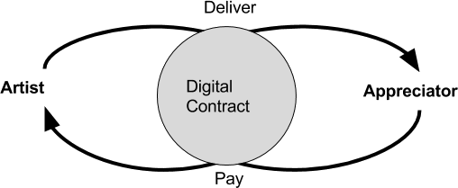

# What's Musicoin

Musicoin is a blockchain-based system for music transactions. Also it's a digital currency to incentivize musicians and listeners to transact directly without royalty intermediaries. Musicoin core system was build upon a modified blockchain from Ethereum.


Musicoin is a blockchain platform, also it's a digital currency to incentivize musicians and listeners to transact directly without royalty intermediaries.To understand Musicoin, you have to know PPP first. As the centerpiece of Musicoin, Pay-Per-Play(PPP) is to address the fundamental issue in music industry, fair and in-time payment. If every play can be paid instantly, there won't be time issue; if every play can be counted with a standard unit,there won't be fairness issue. It's why PPP design is the unique part of Musicoin.



# Build Musicoin client from source

```
# download Musicoin client code
$ git clone https://github.com/musicoin/musicoin
$ cd musicoin

# build in release mode
$ cargo build --release
```

This will produce an executable in the ./target/release subdirectory.

## License
GNU
